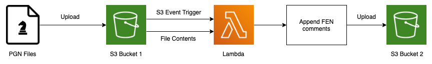

## Description

Slim [Docker](https://www.docker.com/) container-based [AWS Lambda](https://aws.amazon.com/lambda/) function that processes [PGN chess databases](https://en.wikipedia.org/wiki/Portable_Game_Notation) stored on [Amazon S3](https://aws.amazon.com/s3/) and enriches them with [Forsyth–Edwards Notation](https://en.wikipedia.org/wiki/Forsyth%E2%80%93Edwards_Notation) comments using the [pgn-extract](https://www.cs.kent.ac.uk/people/staff/djb/pgn-extract/) CLI tool.

### Architecture

<p align="center">
    
</p>

### Example

Single-game database example of processing using the [pgn-extract](https://www.cs.kent.ac.uk/people/staff/djb/pgn-extract/) binary:

- [Original database](docs/input.pgn)
- [Processed database](docs/output.pgn)

## Usage

### Prerequisites

- [Docker](https://www.docker.com/)
- [GNU make](https://www.gnu.org/software/make/)
- [AWS CLI](https://aws.amazon.com/cli/) for running the sandbox locally and pushing the final image to [Amazon ECR](https://aws.amazon.com/ecr/)

### Configuration

Both build-time and run-time variables are stored in [default.config](default.config) which is loaded into the [Makefile](Makefile).

| Command | Description |
| --- | --- |
| `PGN_EXTRACT_DOWNLOAD_URL` | Download URL of the zipped source code of the targeted version of [pgn-extract](https://www.cs.kent.ac.uk/people/staff/djb/pgn-extract/) |
| `AWS_S3_BUCKET` | Name of the S3 bucket to upload processed PGN databases to when running the sandbox |

### Testing

You can run the function locally by building and running the sandbox image which contains the [AWS Lambda RIE](https://docs.aws.amazon.com/lambda/latest/dg/images-test.html).

```bash
make build-sandbox
```

Running the sandbox image exposes the emulated Lambda environment exposed on the endpoint http://localhost:9000/2015-03-31/functions/function/invocations waiting for [S3 event messages](https://docs.aws.amazon.com/AmazonS3/latest/userguide/notification-content-structure.html).
```
make run-sandbox
```

### Building

```bash
make build
```
